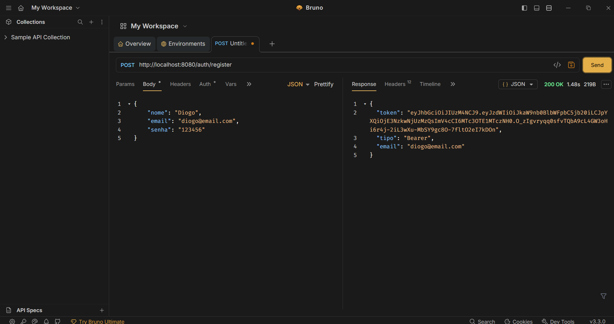
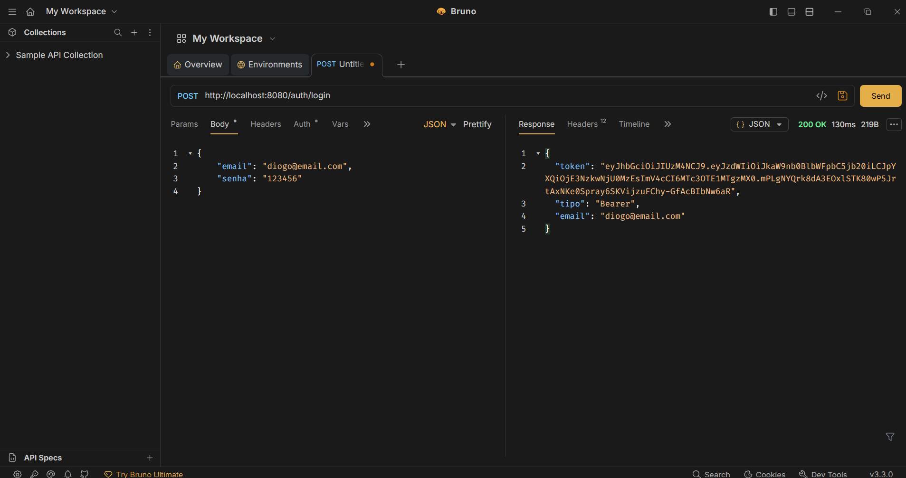
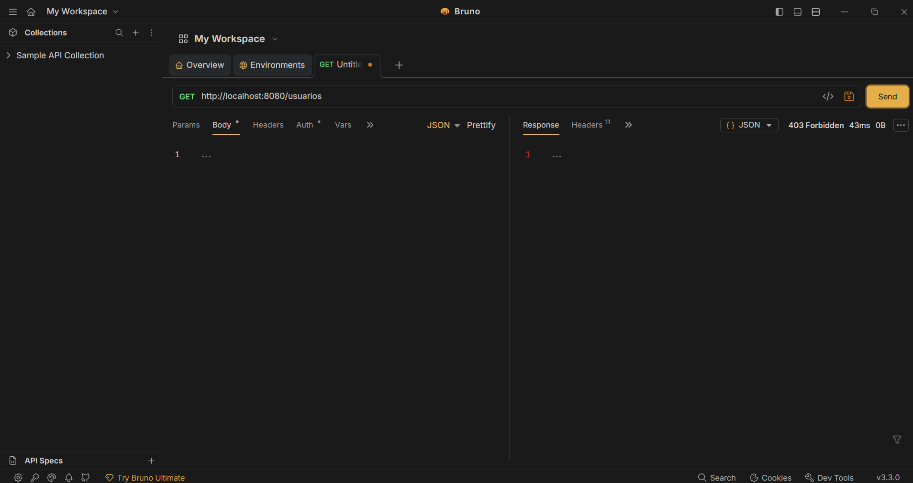
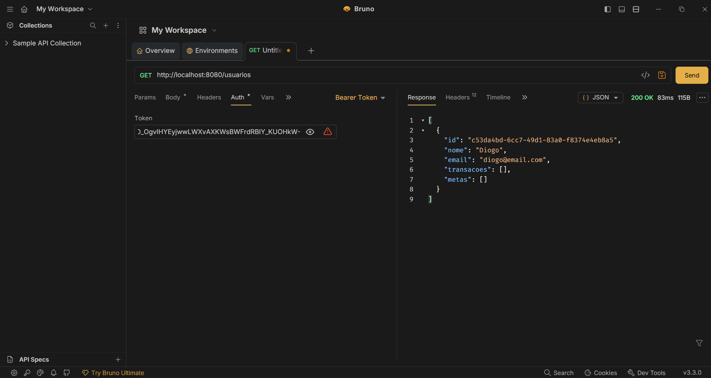
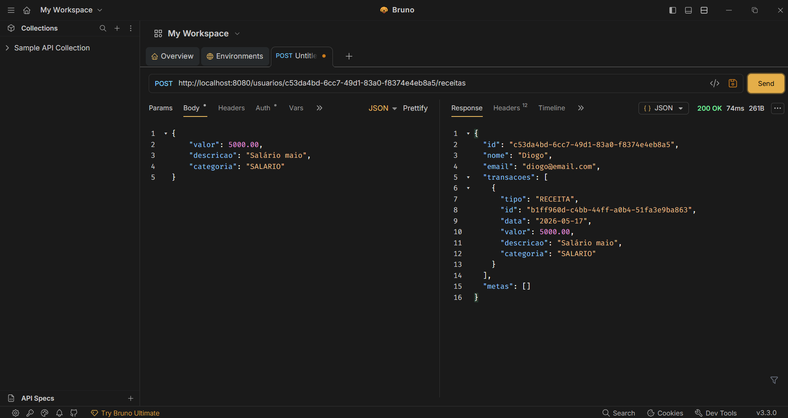
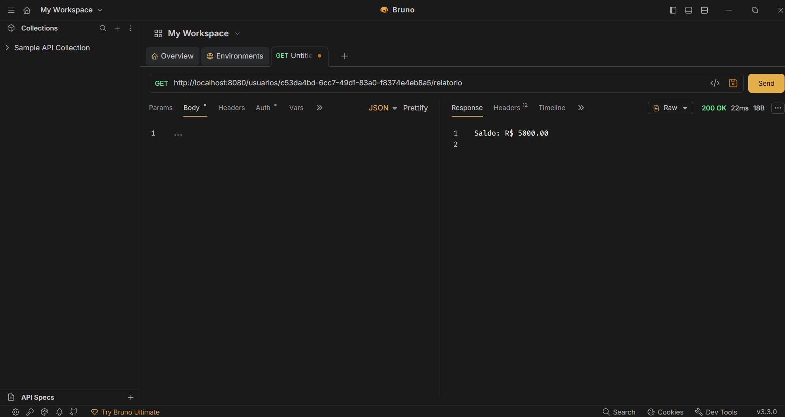

# 💰 FinanceApp

> Sistema de gestão financeira pessoal desenvolvido em Java - do zero até uma API REST completa com autenticação JWT, construído fase por fase sem pular etapas.


---

## 📖 Sobre o projeto

O **FinanceApp** é um sistema completo de gestão financeira pessoal que permite ao usuário controlar receitas, despesas, categorias e metas de gastos mensais com segurança e persistência real.

O projeto foi construído de forma progressiva e intencional - começando com **Java puro e orientação a objetos**, passando por **persistência em JSON**, **banco de dados relacional com JDBC**, até chegar em uma **API REST segura com Spring Boot e JWT**. Nenhuma etapa foi pulada.

---

## 🖥️ Demonstração

### Registro e autenticação


### Login gerando token JWT


### Acesso negado sem token


### Acesso autenticado com Bearer Token


### Adicionando transação autenticada


### Relatório financeiro


---

## ✅ Funcionalidades

- [x] Registro e login com autenticação JWT
- [x] Cadastro de receitas e despesas por categoria
- [x] Cálculo automático de saldo em tempo real
- [x] Metas de gasto por categoria com alertas
- [x] Relatório detalhado por categoria
- [x] Validações e exceções customizadas
- [x] Proteção de rotas - cada usuário acessa só os próprios dados
- [x] Senhas hasheadas com BCrypt

---

## 🏗️ Arquitetura

```
src/
└── main/java/com/financeapp/
    ├── controller/     # Endpoints da API REST
    ├── service/        # Regras de negócio
    ├── repository/     # Acesso e persistência de dados
    ├── model/          # Entidades do domínio
    ├── dto/            # Objetos de transferência de dados
    ├── infra/          # Configurações (JWT, Security, Banco)
    └── exception/      # Exceções customizadas
```

O projeto segue uma arquitetura em camadas com separação clara de responsabilidades. O padrão **Repository** garante que a troca de fonte de dados (JSON → JDBC → JPA) não afeta o restante do sistema.

---

## 🌐 Endpoints da API

### Autenticação - públicos

| Método | Endpoint | Descrição |
|--------|----------|-----------|
| `POST` | `/auth/register` | Registra novo usuário e retorna token JWT |
| `POST` | `/auth/login` | Autentica usuário e retorna token JWT |

### Usuários - requer `Authorization: Bearer {token}`

| Método | Endpoint | Descrição |
|--------|----------|-----------|
| `GET` | `/usuarios` | Lista todos os usuários |
| `GET` | `/usuarios/{id}` | Busca usuário por ID |
| `POST` | `/usuarios/{id}/receitas` | Adiciona receita |
| `POST` | `/usuarios/{id}/despesas` | Adiciona despesa |
| `POST` | `/usuarios/{id}/metas` | Define meta por categoria |
| `GET` | `/usuarios/{id}/relatorio` | Gera relatório financeiro |
| `DELETE` | `/usuarios/{id}` | Remove usuário |

---

## 🧠 Conceitos aplicados

### Fase 1 - Java puro
- Orientação a objetos: herança, polimorfismo e encapsulamento
- Classe abstrata `Transacao` com subclasses `Receita` e `Despesa`
- `Enum` com comportamento próprio (`Categoria`)
- Coleções e Streams: `filter`, `map`, `reduce`, `groupingBy`
- `Optional` para tratamento seguro de nulos
- `BigDecimal` para precisão em cálculos financeiros
- Exceções customizadas com `RuntimeException`
- Programação defensiva com validações no construtor

### Fase 2 - Persistência JSON
- Padrão Repository com interface e implementação separadas
- Serialização de herança com `@JsonTypeInfo` e `@JsonSubTypes`
- Biblioteca Jackson para conversão Java ↔ JSON

### Fase 3 - Banco de dados
- PostgreSQL com tabelas relacionadas por chave estrangeira
- JDBC puro com `PreparedStatement` e `ResultSet`
- `executeBatch` para operações em lote
- Proteção contra SQL Injection com queries parametrizadas

### Fase 4 - Spring Boot + API REST
- Controllers, Services e Repositories com injeção de dependência
- JPA / Hibernate com mapeamento de herança (`SINGLE_TABLE`)
- DTOs com `record` do Java 16+ e validações com Bean Validation
- Tratamento global de erros com `@RestControllerAdvice`
- Spring Data JPA com derived queries

### Fase 5 - Segurança
- Spring Security com política `STATELESS`
- Autenticação via JWT gerado e validado com `jjwt`
- Senhas hasheadas com `BCryptPasswordEncoder`
- Filtro `OncePerRequestFilter` para interceptar requisições
- Mensagens de erro genéricas para evitar enumeração de usuários

---

## 🚀 Como executar localmente

### Pré-requisitos

- Java 17+
- Maven 3.x
- PostgreSQL instalado e rodando

### Configurando o banco

```sql
CREATE DATABASE financeapp;

\c financeapp

CREATE TABLE usuarios (
    id          VARCHAR(36)    PRIMARY KEY,
    nome        VARCHAR(100)   NOT NULL,
    email       VARCHAR(150)   NOT NULL UNIQUE,
    senha       VARCHAR(255)   NOT NULL DEFAULT ''
);

CREATE TABLE transacoes (
    id          VARCHAR(36)    PRIMARY KEY,
    usuario_id  VARCHAR(36)    NOT NULL REFERENCES usuarios(id),
    tipo        VARCHAR(10)    NOT NULL,
    valor       NUMERIC(15,2)  NOT NULL,
    descricao   VARCHAR(255)   NOT NULL,
    categoria   VARCHAR(50)    NOT NULL,
    data        DATE           NOT NULL
);

CREATE TABLE metas (
    id           VARCHAR(36)   PRIMARY KEY,
    usuario_id   VARCHAR(36)   NOT NULL REFERENCES usuarios(id),
    categoria    VARCHAR(50)   NOT NULL,
    valor_limite NUMERIC(15,2) NOT NULL
);
```

### Configurando o application.properties

```properties
spring.datasource.url=jdbc:postgresql://localhost:5432/financeapp
spring.datasource.username=postgres
spring.datasource.password=sua_senha

spring.jpa.hibernate.ddl-auto=update
spring.jpa.show-sql=true

jwt.secret=sua-chave-secreta
jwt.expiration=86400000

server.port=8080
```

### Rodando

```bash
git clone https://github.com/devgarciadiogo/finance-app.git
cd finance-app
mvn spring-boot:run
```

A API estará disponível em `http://localhost:8080`.

---

## 🛠️ Tecnologias

| Tecnologia | Versão | Uso |
|---|--------|---|
| Java | 17     | Linguagem principal |
| Spring Boot | 3.2.5  | Framework web |
| Spring Security | 6.x    | Autenticação e autorização |
| Spring Data JPA | 3.x    | Abstração do banco de dados |
| Hibernate | 6.4    | ORM |
| PostgreSQL | 16+    | Banco de dados relacional |
| jjwt | 0.12.6 | Geração e validação de JWT |
| Jackson | 2.18.3 | Serialização JSON |
| Maven | 3.x    | Gerenciamento de dependências |

---

## 👨‍💻 Autor

Desenvolvido por **[Diogo Garcia]**

[](https://www.linkedin.com/in/diogogarciadev/)
[](https://github.com/devgarciadiogo)

---

## 📄 Licença

Este projeto está sob a licença MIT.
